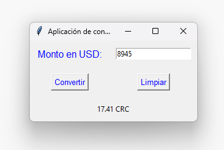
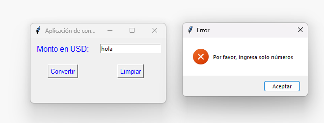
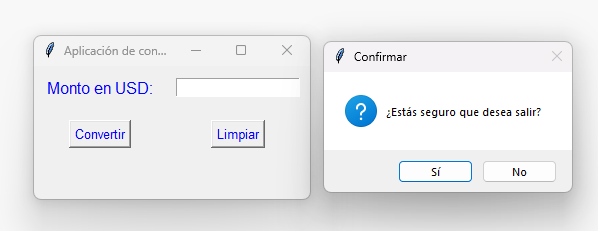

# Aplicación de conversor de unidades
## Modo de uso:

Debe tener instalada la biblioteca Tkinter.
Para que el programa se ejecute, la terminal se debe encontrar en el directorio: *python ./quiz-2/conversorUnidades/conversorUnidades.py*

## Ejemplo de ejecución:

**Conversión regular con resultado esperado:**

**Valor inválido ingresado para la conversión con el mensaje de error:**

**Ventana emergente al cerrar la ventana:**

